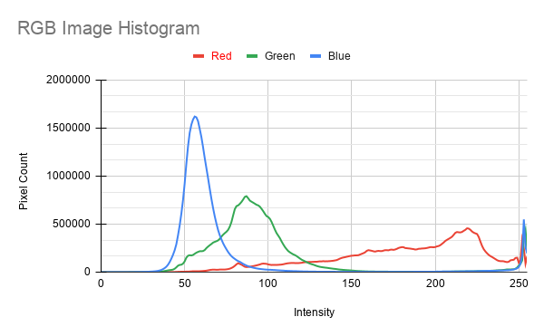

# CUDA Image Histogram

While exploring **CUDA atomic operations**, I thought of building a small project to understand how atomics can be used in a practical parallel computing problem.

I chose an **image histogram** because multiple CUDA threads can end up updating the same histogram bin, making it a good example for understanding why atomic operations are needed.

The project calculates **Red, Green, and Blue histograms** using both CPU and CUDA and compares their results and performance.

## What I Did

* Calculated RGB histograms on the **CPU**.
* Implemented the same calculation using **CUDA**.
* Used **`atomicAdd()`** to safely update histogram bins.
* Compared CPU and GPU results to verify correctness.
* Measured CUDA kernel execution time.
* Exported histogram data to CSV for visualization.

## CUDA Implementation

Each CUDA thread processes pixels in parallel. When multiple threads encounter the same intensity value, they may access the same histogram bin.

```cpp
atomicAdd(&redHistogram[red], 1);
atomicAdd(&greenHistogram[green], 1);
atomicAdd(&blueHistogram[blue], 1);
```

`atomicAdd()` ensures that these concurrent updates are performed safely without race conditions.

## Results

Tested with an **8192 × 4096 image**:

```text
Image Size   : 8192 × 4096
Total Pixels : 33,554,432

CPU Time     : 0.080000 seconds
CUDA Time    : 0.001357 seconds
```

```text
CPU and GPU histograms match successfully!
```

## Histogram Visualization



The histogram contains **256 intensity bins (0–255)** for each RGB channel.

[View histogram CSV](output/histograms.csv)

## Technologies

* C++
* CUDA
* CUDA Atomic Operations
* stb_image
* NVIDIA GPU

## Learning

This project is part of my exploration of CUDA concepts from **CUDA by Example**, with a focus on **parallel execution, atomic operations, GPU memory, and performance measurement**.
